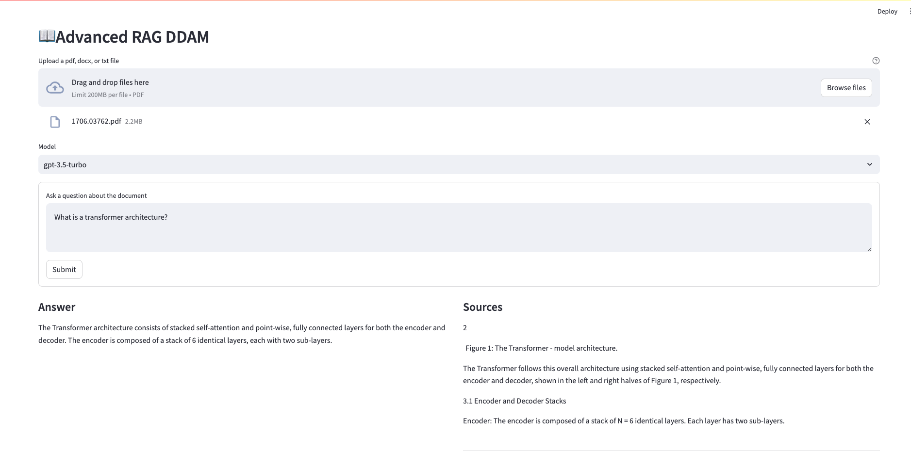

# Advanced RAG

This is a Advanced RAG Streamlit demonstration which consists of contextual chunking and Cohere reranking.

## About

### Contextual Chunking

The method operates sequentially, starting from the very first sentence:

**Extract Embeddings:** For each sentence, we generate an embedding—a vector representation capturing its semantic content.

**Compare Consecutive Sentences:** We then compare the embedding of the first sentence with the second, the second with the third, and so on through the text.

**Detect Break Points:** Our aim is to find points where the difference between embeddings (the "embedding distance") is significantly large. These points indicate a potential shift in topic or section.

**Threshold for New Sections:** We set a specific threshold for embedding distances. When the distance between two consecutive sentences exceeds this threshold, it is considered a break point, signaling the start of a new semantic section.

By following this method, we can programmatically identify sections within a text, aiding in the structuring or analysis of its content.

### Cohere Reranking

**Cohere Reranking** is a simple and very powerful tool to perform semantic search. Given a query and a list of documents, Rerank indexes the documents from most to least semantically relevant to the query.

## How to use

1. You need a [Poetry](https://python-poetry.org/) - Python packaging and dependency management tool to handle the packages needed to run this application.

2. You need an OpenAI API key. You can get your key from [here](https://platform.openai.com/account/api-keys).

3. You need an Cohere API key. You can get your key from [here](https://dashboard.cohere.com/api-keys).

4. Export your API keys to you environment variables:

    ```bash
    EXPORT OPENAI_API_KEY = "sk-***********"
    EXPORT COHERE_API_KEY = "***********"
    ```

5. Install needed dependecies:

    ```bash
    poetry install --no-root
    ```

6. Install spaCy English pipeline - this will be used in chunking.

    ```bash
    python -m spacy download en_core_web_sm
    ```

7. Run.

    ```bash
    poetry run streamlit run main.py
    ```

## Demonstration


